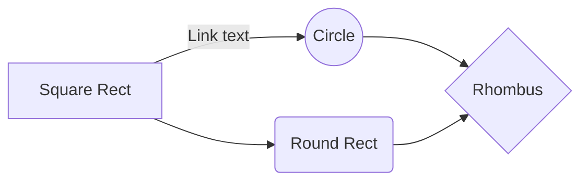
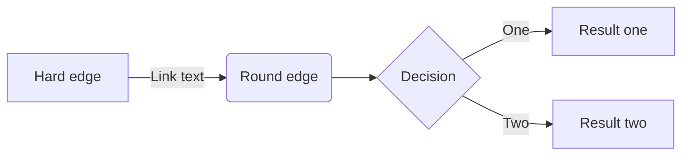

{width=100px height=100px}

# Ingegno
Progetti pazzi per persone pazze

## Introduzione
Ingegno è una rivista tecnica distrubita secondo una scadenza mensile che ad ogni uscita propone un nuovo progetto da realizzare. Si tratta di progetti fuori dal comune, che toccano rami diversi delle materie scientifiche come meccanica, elettronica e informatica. La scrittura di ogni numero viene svolta in diverse fasi prestando particolare attenzione ai dettagli riguardanti la realizzazione del progetto, definiti in formato XML e ad un'impaginazione accattivante permessa grazie all'uso di software professionali come Adobe InDesign. L'uninione di queste due tecnologie ha permesso di creare un layout di base della rivista, che però rimane molto personalizzabile e adattabile rapidamente, a seconda del progetto trattato nel numero in questione. Si è raggiunta una qualità della rivista che permette una lettura molto scorrevole, facile e chiara nelle istruzioni per la realizzazione del progetto.

Breve descrizione del progetto toccando i punti più importanti affrontati nel documento.
*Obiettivi*, *tecnologie*, aspetti salienti del *flusso di gestione documentale*, *risultati* raggiunti.  

## Ideazione 

### Tema
Questo prodotto si pone l'obiettivo ispirare i lettori ad esplorare le frontiere della conoscenza scientifica attraverso la realizzazione di progetti accessibili e stimolanti. Gli appassionati di chimica, fisica, informatica, meccanica e più in generale tutte le materie scientifiche sono tanti; tuttavia, molto spesso, questi temi vengono trattati su supporti diversi. Questa rivista vuole essere un compendio dove ciascun lettore può trovare risposta su materie diverse. Ogni mese viene proposto un nuovo argomento. Per ognuno di essi vi è una prima panoramica generale dopodichè, al lettore viene proposto un nuovo progetto da realizzare riguardante l'argomento trattato; I temi discussi, infatti, sono più facilmente comprensibili se applicati in un contesto reale.

Identificazione dei temi che il prodotto editoriale dovrà presentare. Evidenziare gli argomenti correlati e la tendenza dell'attenzione su questi temi. 

> LM2 slide 28

### Destinatari
La rivista è adatta a tutti in quanto ogni argomento viene trattato con molta semplicità; tuttavia, il progetto è stato ideato prendendo come riferimento alcuni destinatari in particolare. Si tratta di persone appassionate di materie in ambito STEM. Di seguito verranno mostrate 3 personas inventate, ma basate sulla realtà, le quali, probabilmente, sarebbero i soggetti più interessati al prodotto.

Personas come quelle descritte in figura potrebbero usufruire di questo prodotto nel tempo libero, ma non solo. Persone come gli insegnanti, invece, potrebbero prendere degli spunti da alcuni numeri della rivista per creare un argomento di discussione coinvolgente per gli alunni.

Descrivere i destinatari del prodotto editoriale descrivendo le personas alle quali si rivolge il prodotto. Descrivete alcuni scenari d'uso nei quali inserire le personas scelte come destinatari.

> LM2 slide 29-32

### Requisiti di accettazione

Come è già stato spiegato in precedenza, gli argomenti presenti nella rivista, vengono spesso trattati separatamente dai competitor. Inoltre, le istruzioni per la realizzazione di esperimenti e progetti fuori dagli schemi non sono sempre facili da reperire. Questo prodotto, quindi, propone un'innovazione da un punto di vista della qualità dei contenuti andando ad unire appassionati di materie diverse.

Indicate i requisiti di accettazione che dovranno essere soddisfatti per raggiungere i destinatari. Quali modelli di fruizione consideriamo più efficaci per i nostri destinatari? Quali standard consideriamo come riferimento? Quali aspetti di innovazione possiamo proporre? Nella qualità dei contenuti o nel processo di fruizione?

> LM4

### Canali di distribuzione
Ingegno è un progetto nato per il web con particolare attenzione alla condivisione. Si è deciso di esportare ogni numero in formato PDF per via della sua grande portabilità. E' possibile visualizzare gli articoli su tantissimi dispositivi; anche offline, nel caso vengano scaricati in locale. Il formato PDF permette inoltre, di gestire molto facilmente immagini e forme varie, caratteristica di fondamentale importanza per un progetto come questo. Il prodotto viene sviluppato adottando uno stile piuttosto informale, permettendo di raggiungere una più ampia fetta di mercato.

Presentare i canali di distribuzione che si intendono raggiugnere e i formati dati richiesti da ogni canale. Esempi di canali sono: (i) Web, (ii) Social, (iii) Market place, (iv) Intranet. Esempi di formati. (i) Word, (ii) ePub, (iii) CBZ, (iv) PDF, (v) WebBook. 
Proporre alcuni accenni relativi all'identità visuale e alle regole tipografiche o di stile che si intendono seguire. Nel settore esisto classi di documento standard? Dati gli obiettivi è importante trasmettere un senso di adesione a modelli già conosciuti o un senso di innovazione? Lo stile sarà orientato verso un'espressione formale o informale?

## Processo di Produzione

### Acquisizione dei contenuti
Le fonti variano a seconda del progetto mensile che viene proposto. Principalmente provengono dal web. Alcune informazioni sono distruibuite come fonti libere, altre necessitano semplicemente della menzione dell'autore originale. Nella stesura dell'articolo, in partiolare per alcune parti specifiche (istruzioni per la costruzione del progetto) è richiesto un lavoro di redazione manuale. Vengono infatti, realizzate delle immagini raffiguranti i passaggi chiave per ottenere il risultato finale.

Descrivere le fonti che saranno utilizzate nella costruzione del prodotto editoriale. Nella scelta delle fonti valutare il costo di acquisizione: (i) disponibili come fonti libere, (ii) generabili automaticamente, (iii) richiedono un lavoro di redazione manuale.

### Gestione documentale
Attraverso l'analisi del mercato, viene scelto il progetto mensile da editare. Quindi si passa alla ricerca delle fonti e raccolta dei contenuti. Durante questa fase dobbiamo tenere conto degli aspetti legali riguardanti i diritti delle fonti. Gli articoli vengono scritti in formato XML per poi essere importati in Adobe InDesign ed infine esportati in formato PDF. Lo stile grafico viene gestito con Adobe InDesign. Per quanto riguarda le immagini relative alle istruzioni sono realizzate con LibreCAD. Adobe InDesign permette un'ottima gestione dei metadati e di conseguenze è stato scelto per la loro scrittura. La revisione del progetto passa attraverso fasi di rilettura ed analisi a più voci, ponendo particolare attenzione sulla frubilità e veridicità dei contenuti. La rivista viene promossa attraverso i canali social e sul web in generale da cui si ricevono anche eventuali feedback degli utenti, utili per l'analisi post produzione.

Descrivere il *flusso di gestione documentale* definito per il progetto. Ad esempio, (i) la raccolta o produzione dei contenuti, (ii) la valutazione dei diritti, (iii) la trasformazione dei formati, (iv) la strutturazione dei contenuti, (v) l'applicazione dello stile grafico, (vi) la generazione dei metadati, (vii) la distribuzione dei contenuti. Nella descrizione del flusso considerare le  fasi di revisione, controllo e approvazione che possono richiedere le diverse fasi.

> LM2 slide 14-26

### Tecnologie adottate

* XML: E' stato deciso di utilizzare un minimo di 3 file XML. Il primo per strutturare la copertina della rivista, il secondo per l'articolo vero e proprio e il terzo per la pagina finale della rivista. Nel caso siano presenti più articoli in quel numero verranno utilizzati più file XML, uno per ogni articolo oltre a quello per la copertina e la pagina finale.
* Adobe InDesign: E' un software di publishing che ha permesso di realizzare un layout di base della rivista, contenente elementi in comune per ogni numero. Grazie a questo programma è possibile importare file XML e impaginarli automaticamente secondo il layout creato. E' poi possibile apportare modifiche allo stile grafico molto velocemente.
* LibreCAD: E' un software di CAD gratuito e viene utilizzato per la realizzazioni delle immagini raffiguranti i passaggi chiave descritti nelle istruzioni.
* PDF: E' il formato scelto per la distribuzione del prodotto per i motivi spiegati precedentemente.

Descrivere le tecnologie addottate nelle diverse fasi e discuterne il contributo in termini di raggiungimento degli obiettivi descritti negli scenari d'uso.

|                |Scenario 1                          |Scenario 2                       |
|----------------|-------------------------------|-----------------------------|
|Markdown |`'Isn't this fun?'`            |'Isn't this fun?'            |
|XSLT       |`"Isn't this fun?"`            |"Isn't this fun?"            |
|ePud         |`-- is en-dash, --- is em-dash`|-- is en-dash, --- is em-dash|

### Esecuzione del flusso
Sul profilo GitHub è possibile trovare tutti i materiali che permettono di riprodurre il flusso di produzione documentale

Allegare, possibilmente attraverso il riferimento ad un repository documentale, i materiali, gli script, le configurazioni, che permettono di riprodurre il flusso di produzione documentale. I contenuti non devono necessariamente essere completi, può essere sufficiente fornire un prototipo per ogni tipologia di contenuto previsto e per ogni formato di destinazione previsto.  

## Valutazione dei risultati raggiunti

### Valutazione del flusso di produzione
La suddivisione del lavoro in più fasi e l'utilizzo di tecnologie coerenti ad esse permette un risparmio di tempo nel lungo termine.

Per valutare il contributo proposto valutare le diverse fasi del flusso in termini di (i) riduzione dei tempi di gestione documentale, (ii) riduzione degli errori, (iii) miglioramento della qualità dei documenti, (iv) miglioramento del livello di accettazione della tecnologia, (v) raggiungimento di nuovi canali di distribuzione, (vi) soddisfacimento di nuovi scenari d'uso.
 
### Confronto con lo stato dell'arte
Si potrebbe pensare di aggiungere una fase di scrittura dell'articolo in un formato user-friendly per poi convertirlo in XML così da rendere più semplice la sua redazione.

Può anche essere utile confrontare una versione ASIS del flusso di gestione, senza la tecnologia o le innovazioni proposte, e una TOBE che include la tecnologia e le innovazioni proposte dallo studente.

### Limiti emersi
La scelta di procedere in più fasi ha richiesto tempi più lunghi per la stesura del primo numero della rivista. La scelta è stata però dettata dal guadagno a partire dal secondo numero.

È importante sottolineare i limiti emersi. Come l'impossibilità di accesso ad alcune tecnologie o fasi del flusso di gestione documentale, limiti nella automazione di alcune passi di trasformazione dei formati o di integrazione delle sorgenti

## Conclusioni
Il progetto risponde all'esigenza di fruibilità diffusa riuscendo a raggiungere il target previsto. 

Discutere i risultati ottenuti, verificando se gli obiettivi definiti dai casi d'uso siano pienamente o parzialmente raggiunti. Evidenziare gli aspetti nei quali si sono raggiunti i risultati più soddisfacenti e le limitazioni emerse.

## Bibliografia e sitografia

Elencare i riferimenti bibliografici e risorse online che hanno maggiormente contribuito alla realizzazione del progetto. Ad esempio [@sechi2010,@pantieri2021,@ceravolo2023]
